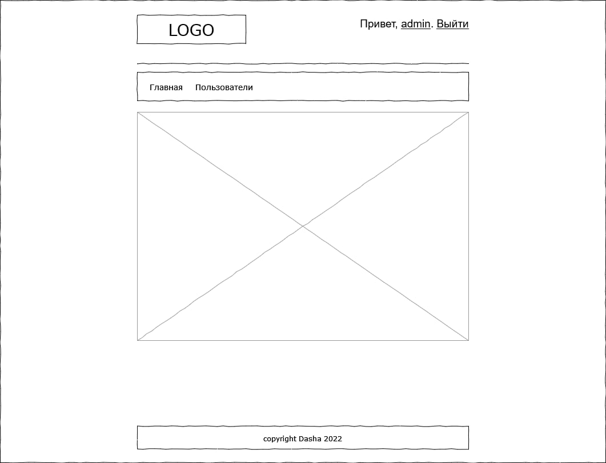

# Задание 5

Используя сессию и фильтр создать механизм авторизации пользователей. 

Запретить доступ неавторизованных пользователей к любой странице приложения за исключением страницы авторизации.

1. После авторизации в программе информация о пользователе должна быть занесена в сессию, пользователь должен оказаться на главной странице приложения.
2. Неавторизованный пользователь в случае попытки доступа к внутренней части приложения должен быть направлен на страницу авторизации.
3. Предусмотреть возможность выхода пользователя из системы.
4. Предусмотреть возможность изменения пользователем своего пароля (опционально)

В качестве технологий использовать диспетчер сервлет+JSP+JSTL, мэппинг для диспетчер-сервлета должен быть следующего вида: `*.jhtml`.

Стартовая страница `index.jsp` должна использовать JSTL тэг `<c:redirect>` и отправлять пользователя на страницу авторизации. 

Приложение должно содержать следующие страницы

| Путь в строке браузера        | JSP страница                 | Комментарий                                  |
|-------------------------------|------------------------------|----------------------------------------------|
| `/webdipatch/`                | `index.jsp`                  | стартовая страница                           |
| `/webdipatch/login.jhtml`     | 	`WEB-INF\jsp\login.jsp`     | 	страница авторизации                        |
| `/webdipatch/welcome.jhtml`	  | `WEB-INF\jsp\welcome.jsp`    | 	главная страница приложения                 |
| `/webdipatch/loginedit.jhtml` | 	`WEB-INF\jsp\loginedit.jsp` | 	страница редактирования пароля пользователя |

Использовать в проекте: `HttpServletResponse.sendRedirect()` и `HttpServletRequest.getRequestDispatcher().forward()`.

Для разбора строки запроса на стороне сервера использовать `HttpServletRequest.getContextPath()` и `HttpServletRequest.getServletPath()`.

### В качестве подсказки можно воспользоваться следующим примером кода:

```
String action = req.getParameter(ACTION_PARAM);
if (LOGIN_ACTION_PERFORM.equals(action)) {
   if (securityService.login(userInfo)) {
      req.getSession().setAttribute(CommonConstant.USER_INFO_KEY, userInfo);
      resp.sendRedirect(req.getContextPath() + WELCOM_PAGE + ".jhtml");
   } else {
      req.setAttribute("errorMessage", "Error login or password");
      req.getRequestDispatcher(JSP_PATH + LOGIN_PAGE + ".jsp").forward(req, resp);
   }
} else {
   req.getRequestDispatcher(JSP_PATH + LOGIN_PAGE + ".jsp").forward(req, resp);
}
```


# Задание 6

1) сделать верстку
2) страница со списком пользователей с кнопками добавить редактировать удалить
3) страницы соответственно добавления/редактирования
4) сделать две роли - админ и пользователь
5) админам доступен весь функционал
6) пользователям видна только главная страница с приветственным сообщением, 
7) и пункт меню для списка пользователей не должен отображаться даже
8) Модель пользователей расширить :
- login
- password
- email
- surname
- name
- patronymic
- birthday
- роль
9) сделать валидацию для полей(формат обязатаельность)
10) Изучить Expression Language (EL) (то что пишется в `${}`). 

основные примеры можно посмотерть по адресу `http://localhost:8080/examples/jsp/` (томкат запустить не из эклипса а через `startup.bat`) - первый пример.


# Задание 7
1. Создать тэги(файлы с расширение `.tag`) чтобы убрать дублирующую верстку(шапка приложения, футер меню и т д)
2. Жава код писать не надо - все делается в этих файлах `.tag`
3. у вас получится один или тнесколько тегов и один корневой(например `myhtml`)
   страница спользователями будет выглядеть примерно так:
   `<t:myhtml title="Пользователи">`
   верстка таблицы с пользователями
   `</t:myhtml>`
   при этом повторяющегося кода с футером и шапкой уже не будет, он будет располгаться в файлах `.tag`

# Задание 8
Привести приложение с типичный трех словной архитектуре - dao service web

# Задание 9
Сделать ваши dao и service синглтонами

# Задание 10
Создать две фабрики(паттерн factory) для создание dao и service (одна фабрика для дао, вторая для service)

# Задание 11

Поставить Postgres(задания выполнять в нем и сохранять в файл один общий с комментариями)

Присоединять БД к приложению пока не надо.

Что нужно знать:
1. Субд.
2. Атрибуты, записи, поля, таблицы (отношения). 
3. Первичный ключ, внешний ключ. 
4. связи между таблицами. 
5. Индексы. 
6. Нормальные формы (первая - третья).

SQL задания
1. создать схему  authorization c владельцем - своей ролью

Создать таблицы:
- users:  (пользователи)
- id
- должны быть поля:
- логин - уникальное не пустое
- пароль - не пустое
- имя - не пустое
- дата рождения - возможно пустое
- id - первичный ключ
- roles: (роли пользователей)
- id
- наименование - не пустое уникальное
- id - первичный ключ
2. Изменить таблицу пользователи
- добавить колонку возраст (непустое, значения только больше 18)
- добавить колонку зарплата  (пустое)
- добавить индекс на имя пользователя
- добавить связь с таблицей ролей

3. Заполнить данными (с помощью sql).
   Ролей не менее 5. пользователей не менее 15 (данные разнообразные. например имена не name1, name2 а хотя бы половина понятных "Вася, Петя". необязательные поля заполнять по желанию).
4. Выборки (Где не указанно конкретно должны выводиться все колонки)
- выбрать всех пользователей
- выбрать всех пользователей  с непустой датой рождения
- выбрать всех пользователей  с датой рождения в заданных пределах (от и до)
- выбрать количество пользователей  с одинаковым возрастом (на выходе 2 колонки - возраст и количество)
- к предыдущему добавить ограничение по количеству только больше 1 и отсортировать по количеству по убыванию
- выбрать только пользователей с ролями (роли так же вывести)
- выбрать всех пользователей и их роли
- ограничить  вывод предыдущего запроса 5ю записями (потом начиная с 3й)
5. Изменить таблицу пользователи
- изменить колонку зарплата   на непустое со значением по умолчанию - 1000 (старые значения сохранить)
- посчитать среднюю зарплату пользователей с возрастом меньше 25 и отдельно (использовать объединение запросов) больше 25

6. Обновление
- Всем у кого зарплата меньше 3000 добавить к зарплате 20%
- Тем у кого имя начинается на заданную букву роль установить на "Менеджер" (если такой нет любую из имеющихся)

7.  Перевести хранение ролей на схему с возможностью задания нескольких ролей одному пользователю. Предусмотреть сохранение имеющихся у пользователей ролей. Подумать о первичном ключе.
8.  Повторить запросы:
- Назначить заданному пользователю какие либо 3 роли которые у него отсутствуют
- выбрать всех пользователей и их роли
- выбрать только пользователей с ролями
- Удалить выбранного пользователя (у которого есть роли)
9. Задание
- выбрать всех пользователей и все роли независимо от привязок одним запросом
- выбрать всех пользователей и все роли для которых соответственно нет привязок ролей и пользователей

# Задание 12

1. Подключить бд к вашему приложению. (заменить слой дао на новую имплементацию)
2. Сделать множественный выбор ролей

# Задание 13

1.  Подключить `spring boot`
2.  В рамках задание реализовать только `Dependency Injection` никакие технологии подключать не надо
3.  Что должно получится в итоге
- удаляем все фабрики
- удаляем код по синглтонам
- все дао помечены `@Repository`
- все сервисы `@Service`
- дао внутри сервиса `@Autowired private UserDao userDao;`
- сервис внутри сервлета `@Autowired private UserService userService;`